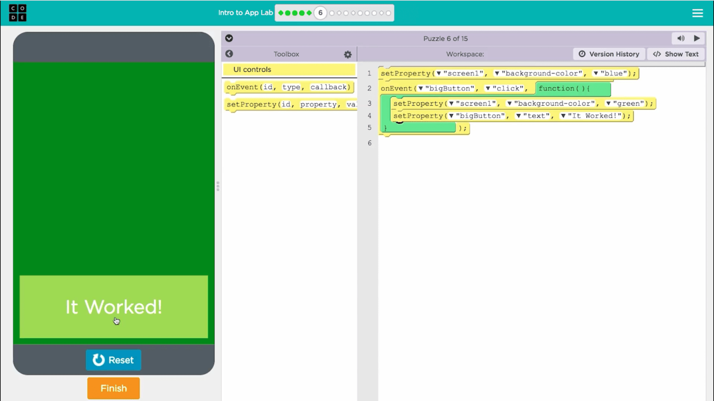

##  The Relevance intervention
There is evidence that gender stereotypes develop early, but little evidence on interventions that target this early development of stereotypes, and none that relate specifically to computing. This pilot intervention focuses on students in Year 8 and builds on evidence that linking learning to everyday life can help student engagement.

In the Relevance trial, you will support students to identify real-world problems and produce an app that can address their chosen problem. This will develop a number of technical skills within a more practical context, which will help to link computing to everyday life.

The Relevance trial introduces fundamental computing concepts. The trial focuses on two strands:
1. Identifying real-world problems that can be addressed with apps 
2. Programming an app in App Lab

**1. Identifying real-world problems that can be addressed with apps** is a means of exploring computer programming by relating it to students' interests. Students develop their skills to:
+ Identify real-world problems
+ Review the content in relevant apps
+ Understand the potential of varied content in app design: images, video, text
+ Understand the importance of user interaction in app design
+ Identify an original idea for an app that addresses a real-world problem
+ Prepare a flow chart to map user interaction for the app, as well as identify a sequence for their program
+ Prepare pseudocode to sketch out their program

**2. Programming an app in App Lab**. Students convert their idea by programming an app. They:
+ Organise code around programming constructs
+ Create sequence
+ Use repetition (iteration), if required
+ Use selection
+ Introduce input and output processes
+ Solve problems (debug) as the program develops

You will have the chance to familiarise yourself with the programming environment in Part 3 of this online course.

For the 'Relevance' trial, students learn to program in [App Lab](https://code.org/educate/applab){:target="_blank"}, an age-appropriate, block-based programming tool where they will create their own app. App Lab is developed in JavaScript, offering students the opportunity to go on to text-based programming in the future.

Some students may have already programmed in a block-based programming language such as [Scratch](https://scratch.mit.edu){:target="_blank"}. Block-based programming environments aid students' understanding of programming concepts because the programming environment is visual. Students select and drag interlocking coloured blocks rather than typing syntax-based code.

The pictures below compare the Scratch and App Lab programming environments:

{:width="400px"}
{:width="400px"}

Click the green button (below right) to go to the next step in Part 1.

You can go back to the [start of Part 1 here](https://projects.raspberrypi.org/en/projects/Year8-RelevanceTraining-Part1-GBICi4).
You can access the [menu for Parts 1, 2, and 3 here](https://projects.raspberrypi.org/en/pathways/year8-relevancetraining-gbici4).
